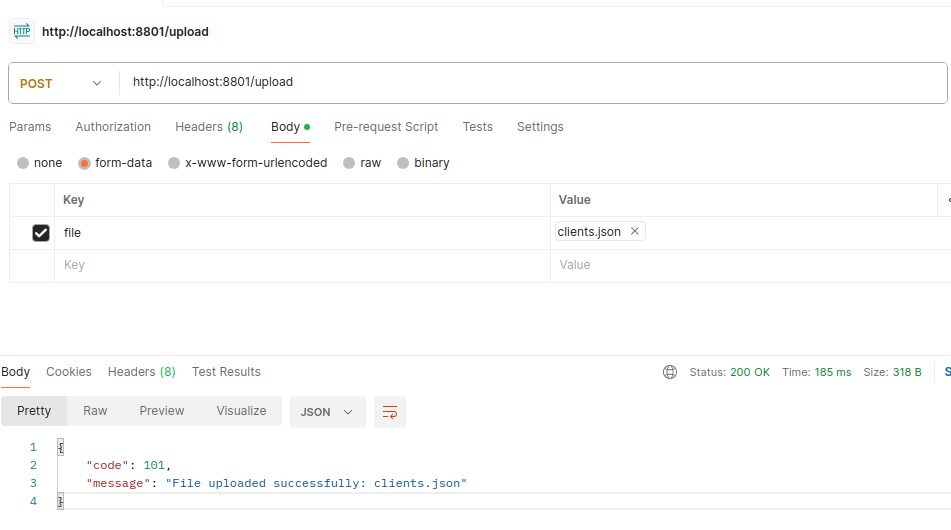

UPLOAD DEMO
-----------------------------------------------------------------------------------------------------

**A JSON file is received and processed in a Rest API.**


**Each row in the file is stored in Azure SQL.**


-----------------------------------------------------------------------------------------------------

**The file contains this data:**

```

[
  { "id": 1, "name": "Alice", "email": "alice@example.com" },
  { "id": 2, "name": "Bob", "email": "bob@example.com" },
  { "id": 3, "name": "Charlie", "email": "charlie@example.com" },
  ...
  ...
  ...
]

```

-----------------------------------------------------------------------------------------------------

**Endpoint that receives the file:**

```
    @PostMapping
    public ResponseEntity<ResponseUploadDTO> uploadFile(@RequestParam("file") MultipartFile file) {
        log.debug("[uploadFile][BEGIN]");
        ResponseUploadDTO responseUploadDTO = fileUploadService.uploadClientsFile(file);
        log.debug("[uploadFile][END]");
        return ResponseEntity.ok(responseUploadDTO);
    }
```

-----------------------------------------------------------------------------------------------------

**Method that handles the JSON file:**

```
    @Override
    public ResponseUploadDTO uploadClientsFile(MultipartFile file) {
        log.debug("[uploadClientsFile][BEGIN]");

        ResponseUploadDTO responseDTO = ResponseUploadDTO.builder().build();
        try {
            List<ClientDTO> clients = objectMapper.readValue(file.getInputStream(), new TypeReference<List<ClientDTO>>() {});
            clients.forEach(client -> log.debug("[uploadClientsFile][client: {}]", client));
            responseDTO.setCode(101);
            responseDTO.setMessage("File uploaded successfully: " + file.getOriginalFilename());
        } catch (Exception e) {
            responseDTO.setCode(102);
            responseDTO.setMessage("Failed to upload file: " + e.getMessage());
            log.error("[uploadClientsFile][error: {}]", e.toString());
        }

        log.debug("[uploadClientsFile][END]");
        return responseDTO;
    }
```

-----------------------------------------------------------------------------------------------------

**The endpoint is executed using Postman:**



-----------------------------------------------------------------------------------------------------